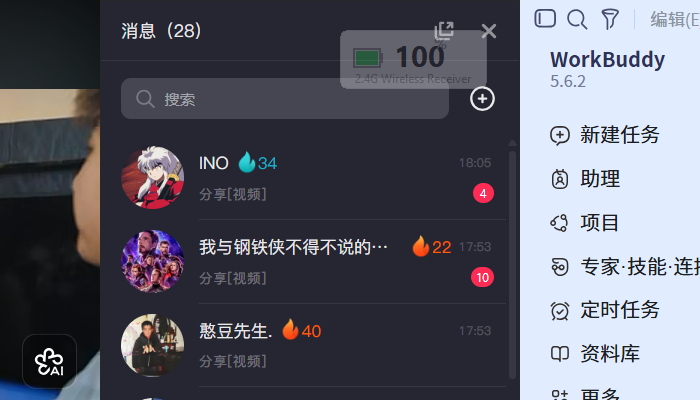
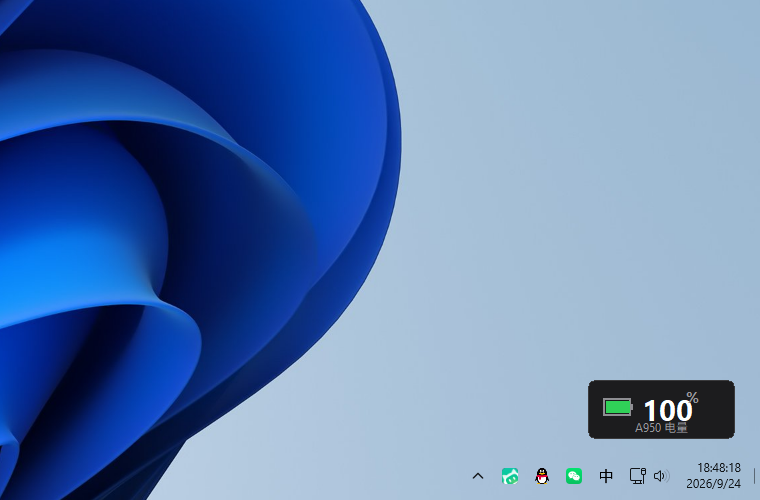

<div align="center">

# 🔋 MousePower

**通用无线鼠标电量桌面工具 — 让任意电脑的无线鼠标都能实时显示电量**

托盘数字图标 · 置顶浮窗 · 深浅主题 · 透明度/颜色/尺寸自由定制

`Windows 10/11` · `免驱动后台常驻` · `安装版仅 22MB`


</div>

---

## ✨ 特性

- **三层通用电量检测**：蓝牙鼠标开箱即用（走 Windows 系统电池缓存）；2.4G 接收器设备通过厂商协议插件扩展；固件遵循 USB-IF 电池规范的设备直接走标准 HID 通道
- **系统托盘**：百分比数字 / 电池条两种图标，悬停显示设备与电量详情
- **置顶浮窗**：屏幕右下角常驻电量卡片，自动跟随鼠标所在显示器，支持位置记忆
- **深度自定义**：透明度（30%–100%）· 位置锁定 · 深/浅/跟随系统主题 · 8 色 Fluent 强调色 · 三档尺寸
- **Win11 风格设置窗口**：圆角卡片 + Fluent 色板，所有改动即时生效、自动保存
- **低电量提醒**：低于阈值弹 Windows 原生通知，同一轮只提醒一次
- **轻量常驻**：后台内存占用低，厂商驱动（如达尔优 OemDrv）可完全关闭，不影响读数

## 📸 截图

| 置顶浮窗 | 桌面效果 |
|---|---|
|  |  |

## 🧭 三层检测架构

```
扫描系统全部 HID / 蓝牙设备 → 识别鼠标与接收器
   │
   ├─ L1 系统标准层（零逆向，覆盖率最高）
   │    ├─ 蓝牙鼠标: Windows PnP 电池缓存 (BTHENUM / BTHLE)
   │    └─ USB / 2.4G: HID Battery System Usage Page (0x85)
   │
   ├─ L2 厂商协议插件层（VID/PID 匹配，开放扩展）
   │    └─ 内置: 达尔优 A950 / Compx 系列接收器
   │
   └─ L3 兜底层
         └─ 不支持电量的设备诚实显示"电量不可读"，绝不误导
```

### 支持设备

| 连接方式 | 支持情况 |
|---|---|
| 蓝牙无线鼠标 | ✅ 绝大多数开箱即用（Windows 标准电池缓存） |
| 2.4G 接收器 · 达尔优 A950 系列 | ✅ 内置协议支持 |
| 2.4G 接收器 · 其他品牌 | ⏳ 视固件是否走标准电池通道；欢迎 PR 扩展 Provider |
| 有线鼠标 | ➖ 普遍不上报电量，显示"电量不可读" |

新增品牌只需在 `core/providers/` 实现一个 Provider 类（约 60 行），无需改动框架。

## 📦 安装

前往 [Releases](../../releases) 下载：

- **`MousePower-Setup-vX.X.X.exe`** — 安装版，内置 Windows 11 官方主题安装向导（深浅色跟随系统）
- **`MousePower-vX.X.X-portable.zip`** — 便携版，解压即用

> 首次运行如遇 Windows SmartScreen 提示，点击 **更多信息 → 仍要运行** 即可
> （程序未做代码签名，此为正常提示；全部源码开源可自行审查或从源码构建）

## 🚀 使用

1. 启动后自动扫描设备，托盘与浮窗显示当前鼠标电量
2. **右键托盘图标**：立即刷新 / 显示隐藏浮窗 / 设置 / 退出
3. **设置窗口**：透明度、锁定位置、主题、强调色、尺寸、通知阈值、开机自启、刷新间隔
4. 浮窗可直接拖动（设置里可锁定），位置自动记忆

## 🛠️ 从源码构建

```bash
# 环境: Windows 10/11 + Python 3.13
pip install hidapi pystray pillow pyinstaller

# 直接运行
pythonw src\mousepower\main.py

# 一键构建 exe + Inno Setup 7 安装包 + 便携包
python build.py
```

## 📁 项目结构

```
src/mousepower/
├── main.py                # 入口：单实例锁 + 模块装配 + 刷新循环
├── config.py              # %APPDATA%\MousePower\config.json 持久化
├── core/
│   ├── scanner.py         # 设备扫描 / 三层识别管线
│   ├── device.py          # DeviceInfo / BatteryInfo 模型
│   ├── std_battery.py     # L1: HID 标准电池 (ctypes hid.dll)
│   ├── bt_battery.py      # L1: 蓝牙 PnP 电池属性 (cfgmgr32)
│   └── providers/         # L2: 厂商协议插件
│       ├── base.py        #   Provider 接口
│       └── dareu_compx.py #   达尔优 A950 / Compx 协议
└── ui/
    ├── widget.py          # 置顶浮窗
    ├── tray.py            # 系统托盘 + 通知
    ├── settings_window.py # Win11 风格设置窗口
    └── theme.py           # 主题色板
```

## 🗺️ Roadmap

- [ ] 罗技 HID++ 协议支持（v1.1）
- [ ] 多设备同时显示（每设备独立浮窗）
- [ ] 中英双语界面
- [ ] 全屏游戏自动隐藏浮窗

## 📄 License

[MIT](LICENSE)

---

<div align="center">

**English**

A lightweight Windows tray & floating widget that shows battery level for
**any** wireless mouse — Bluetooth mice work out of the box via the Windows
battery cache, 2.4G dongles are supported through pluggable vendor-protocol
providers (Dareu A950 / Compx built-in). Deeply customizable: opacity, lock
position, dark/light/auto theme, 8 accent colors, 3 sizes.

</div>
